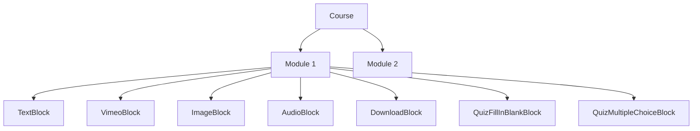

# Module Block Architecture

This document explains how content blocks are structured within course modules. The block-based system is a composable content architecture that allows admins to build rich, multi-format learning modules from discrete content units.

---

## 1. Core Concept

Every module uses a **block-based** architecture (`type: "blocks"`). A module contains an ordered array of `ModuleBlock` objects, each rendering a different type of content.



---

## 2. TypeScript Definitions

Defined in `src/types/index.ts`:

```typescript
export type BlockType = 
    | 'text' 
    | 'audio' 
    | 'image' 
    | 'download' 
    | 'vimeo'
    | 'quiz_fill_in_blank' 
    | 'quiz_multiple_choice';

export interface ModuleBlock {
    id: string;       // Unique block identifier
    type: BlockType;  // Determines which component renders this block
    data: any;        // Shape depends on `type` (see Section 4)
}

export interface CourseModule {
    id: string;
    title: string;
    description?: string;
    isCompleted: boolean;
    type: 'blocks';
    order: number;
    blocks: ModuleBlock[];
}
```

---

## 3. Rendering Pipeline

The `ModulePlayer.tsx` page handles rendering via `renderModuleContent()`. It iterates over the module's `blocks` array and renders each block via a `switch` statement:

```typescript
// Simplified rendering logic from ModulePlayer.tsx
return module.blocks.map((block) => {
    switch (block.type) {
        case 'text': return <TextBlock data={block.data} />;
        case 'audio': return <AudioBlock data={block.data} />;
        case 'image': return <ImageBlock data={block.data} />;
        case 'download': return <DownloadBlock data={block.data} />;
        case 'vimeo': return <VimeoBlock data={block.data} />;
        case 'quiz_fill_in_blank': return <QuizFillInBlankBlock data={block.data} />;
        case 'quiz_multiple_choice': return <QuizMultipleChoiceBlock data={block.data} />;
        default: return <UnsupportedBlock />;
    }
});
```

---

## 4. Block Types & Data Schemas

### `text`
Renders paragraphs of plain text.
| Field | Type | Description |
|:---|:---|:---|
| `content` | `string` | The text content (supports `\n`). |

---

### `audio`
Renders a styled audio player.
| Field | Type | Description |
|:---|:---|:---|
| `audioUrl` | `string` | URL to the MP3 file. |
| `title` | `string` | Optional title. |

---

### `image`
Renders an image with caption.
| Field | Type | Description |
|:---|:---|:---|
| `imageUrl` | `string` | URL to the image. |
| `caption` | `string` | Optional caption. |

---

### `download`
Renders a file download card.
| Field | Type | Description |
|:---|:---|:---|
| `fileUrl` | `string` | URL to the file. |
| `fileName` | `string` | Display name. |

---

### `vimeo`
Renders an embedded Vimeo player.
| Field | Type | Description |
|:---|:---|:---|
| `videoUrl` | `string` | Vimeo URL or ID. |

---

### `quiz_fill_in_blank`
Text-based quiz with inline input fields.
| Field | Type | Description |
|:---|:---|:---|
| `content` | `string` | Text with `[answer]` placeholders. |
| `answers` | `string[]` | Correct answers in order. |

---

### `quiz_multiple_choice`
Multiple choice questions with optional set support.
| Field | Type | Description |
|:---|:---|:---|
| `questions` | `object[]` | Array of `{ question, options, correctIndex }`. |
| `question` | `string` | (Legacy) Single question text. |
| `options` | `string[]` | (Legacy) Single question options. |
| `correctIndex`| `number` | (Legacy) Single question answer. |

---

## 5. File Map

| File | Purpose |
|:---|:---|
| `src/types/index.ts` | Type definitions |
| `src/pages/ModulePlayer.tsx` | Rendering orchestrator |
| `src/components/modules/blocks/` | React components for blocks |