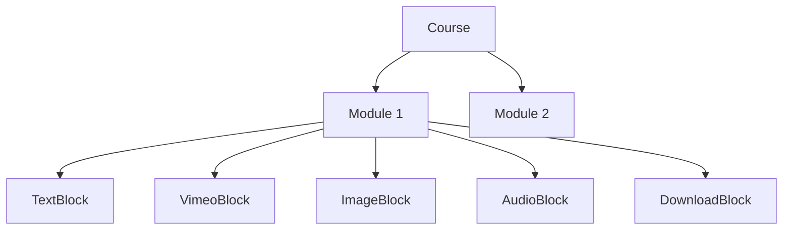

# Module Block Architecture

This document explains how content blocks are structured within course modules. The block-based system is a composable content architecture that allows admins to build rich, multi-format learning modules from discrete content units.

---

## 1. Core Concept

Every module uses a **block-based** architecture (`type: "blocks"`). A module contains an ordered array of `ModuleBlock` objects, each rendering a different type of content.



---

## 2. TypeScript Definitions

Defined in `src/types/index.ts`:

```typescript
export type BlockType = 'text' | 'audio' | 'image' | 'download' | 'vimeo';

export interface ModuleBlock {
    id: string;       // Unique block identifier
    type: BlockType;  // Determines which component renders this block
    data: any;        // Shape depends on `type` (see Section 4)
}

export interface CourseModule {
    id: string;
    title: string;
    description?: string;
    isCompleted: boolean;
    type: 'blocks';
    order: number;
    blocks: ModuleBlock[];
}
```

---

## 3. Rendering Pipeline

The `ModulePlayer.tsx` page handles rendering via `renderModuleContent()`. It iterates over the module's `blocks` array and renders each block via a `switch` statement:

```typescript
// Simplified rendering logic from ModulePlayer.tsx
return module.blocks.map((block) => {
    switch (block.type) {
        case 'text':           return <TextBlock data={block.data} />;
        case 'audio':          return <AudioBlock data={block.data} />;
        case 'image':          return <ImageBlock data={block.data} />;
        case 'download':       return <DownloadBlock data={block.data} />;
        case 'vimeo':          return <VimeoBlock data={block.data} />;
        default:               return <UnsupportedBlock />;
    }
});
```

---

## 4. Block Types & Data Schemas

Each block type has a specific `data` shape consumed by its React component in `src/components/modules/blocks/`.

### `text`
Renders paragraphs of plain text, split by newlines.

| Field | Type | Required | Description |
|:---|:---|:---|:---|
| `content` | `string` | Yes | The text content. Supports `\n` for paragraph breaks. |

**Component**: `TextBlock.tsx`

---

### `audio`
Renders a styled audio player with an optional title.

| Field | Type | Required | Description |
|:---|:---|:---|:---|
| `audioUrl` | `string` | Yes | URL to the audio file (MP3). |
| `title` | `string` | No | Optional heading above the player. |

**Component**: `AudioBlock.tsx`

---

### `image`
Renders an image with an optional caption.

| Field | Type | Required | Description |
|:---|:---|:---|:---|
| `imageUrl` | `string` | Yes | URL to the image file. |
| `caption` | `string` | No | Optional caption displayed below the image. |

**Component**: `ImageBlock.tsx`

---

### `download`
Renders a clickable download link styled as a card.

| Field | Type | Required | Description |
|:---|:---|:---|:---|
| `fileUrl` | `string` | Yes | URL to the downloadable file. |
| `fileName` | `string` | Yes | Display name for the file. |

**Component**: `DownloadBlock.tsx`

---

### `vimeo`
Renders an embedded Vimeo video player in a 16:9 iframe.

| Field | Type | Required | Description |
|:---|:---|:---|:---|
| `videoUrl` | `string` | Yes | Full Vimeo URL or just the video ID (e.g., `"123456789"` or `"https://vimeo.com/123456789"`). |

**Component**: `VimeoBlock.tsx` — Extracts the video ID via regex and builds an embed URL.

---

## 5. Firestore Document Structure

A module stored in Firestore (as a document in the `modules` sub-collection under `courses/{courseId}`) looks like this:

```json
{
  "id": "module_abc123",
  "title": "Understanding Patient History",
  "type": "blocks",
  "order": 2,
  "isCompleted": false,
  "blocks": [
    {
      "id": "blk_1",
      "type": "text",
      "data": { "content": "In this section, you will learn how to take a patient history effectively.\nPay attention to the key phrases used." }
    },
    {
      "id": "blk_2",
      "type": "vimeo",
      "data": { "videoUrl": "https://vimeo.com/987654321" }
    },
    {
      "id": "blk_3",
      "type": "image",
      "data": { "imageUrl": "https://storage.googleapis.com/.../diagram.png", "caption": "Communication flow diagram" }
    },
    {
      "id": "blk_4",
      "type": "audio",
      "data": { "audioUrl": "https://storage.googleapis.com/.../sample.mp3", "title": "Sample Consultation" }
    },
    {
      "id": "blk_5",
      "type": "download",
      "data": { "fileUrl": "https://storage.googleapis.com/.../worksheet.pdf", "fileName": "Practice Worksheet.pdf" }
    },
  ]
}
```

---

## 6. File Map

| File | Purpose |
|:---|:---|
| `src/types/index.ts` | `BlockType`, `ModuleBlock`, and `CourseModule` type definitions |
| `src/pages/ModulePlayer.tsx` | Orchestrates block rendering via `renderModuleContent()` |
| `src/components/modules/blocks/TextBlock.tsx` | Renders `text` blocks |
| `src/components/modules/blocks/AudioBlock.tsx` | Renders `audio` blocks |
| `src/components/modules/blocks/ImageBlock.tsx` | Renders `image` blocks |
| `src/components/modules/blocks/DownloadBlock.tsx` | Renders `download` blocks |
| `src/components/modules/blocks/VimeoBlock.tsx` | Renders `vimeo` blocks |
| `src/lib/courseService.ts` | CRUD operations for courses and modules in Firestore |
